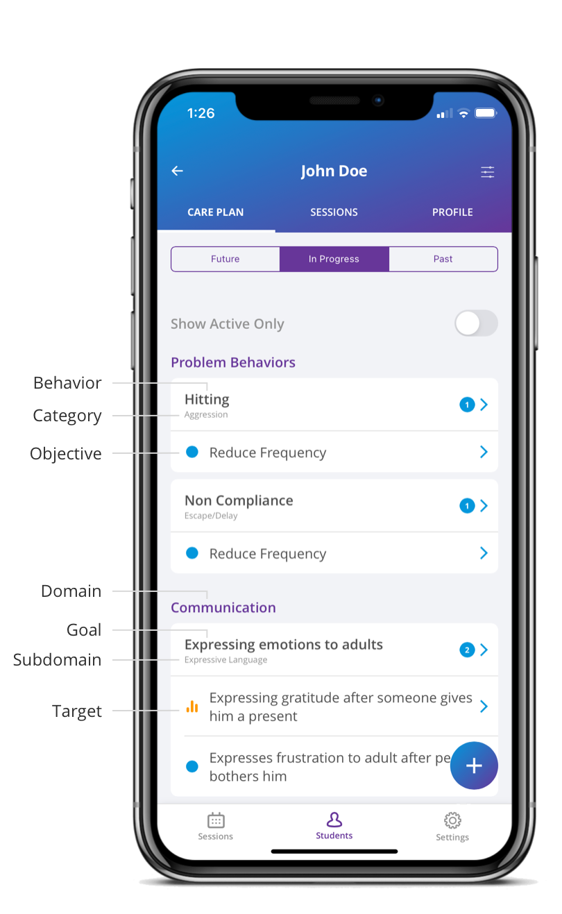

A care plan consists of skill acquisition targets and problem behaviors. 

## Skill Acquisition

The structure of a skill acquisition target is: 

1. Domain 
2. Subdomain 
3. Goal 
4. Target 

The structured hierarchy creates an organized care plan and makes every student have the same structure.   

The domains and subdomains relate to core Autism deficits and are managed by the practice in Autism Care. 

You will have your own list of goals and targets (link) consisting of custom goals and targets (link) and goals and targets imported from the public library (link). 
 

## Problem Behavior

The structure of a problem behavior is: 

1. Category 
2. Problem Behavior 
3. Objective (Form of Measure) 