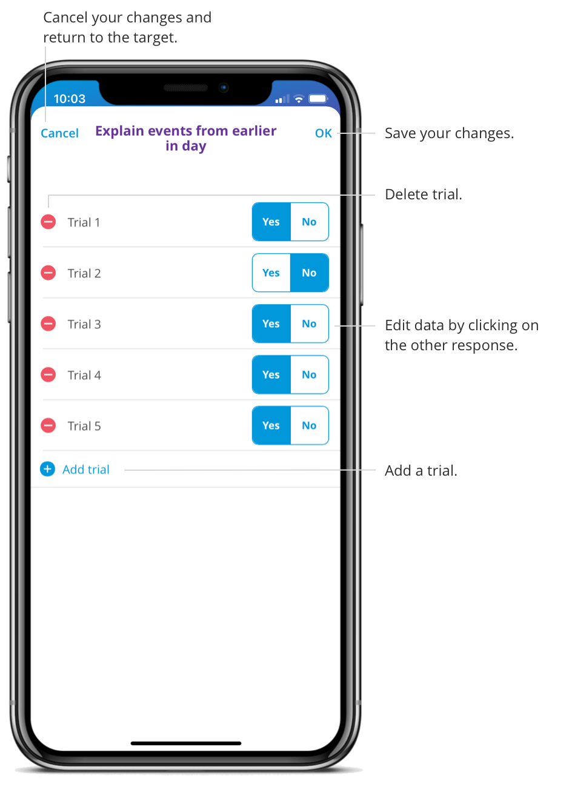

After you end your session, you can edit the session data by selecting a target and clicking Edit in the top right corner.  

You can add, delete or change a response. Click OK to save your changes. You can't edit a target if the session was already submitted.