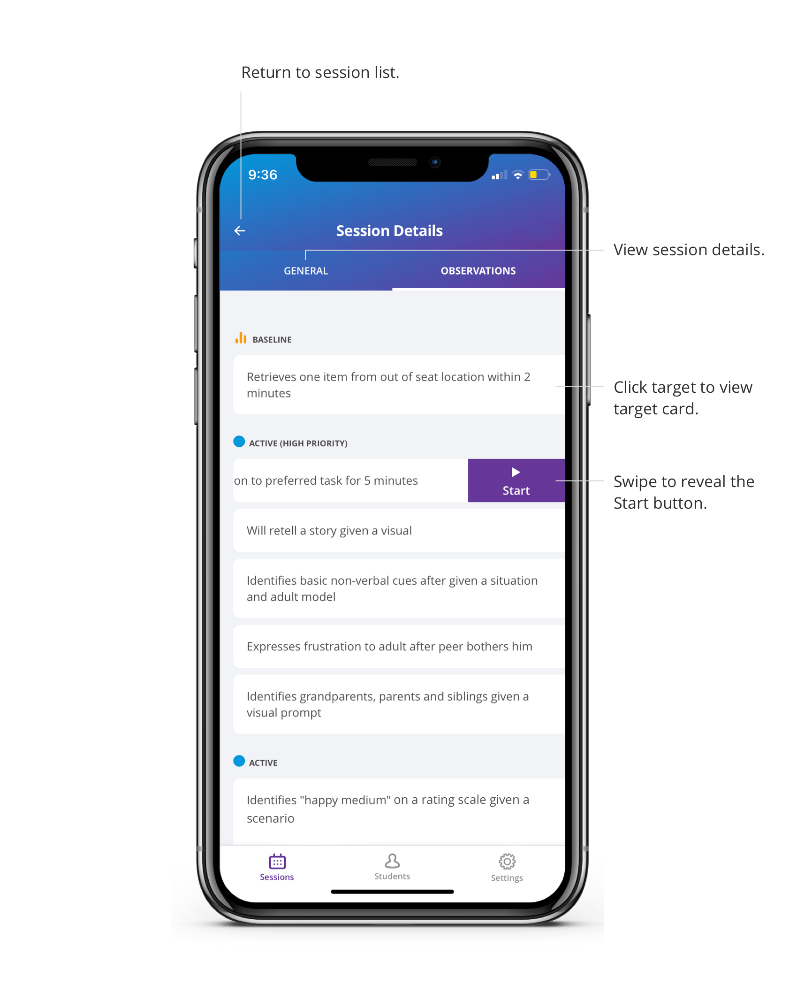

This feature gives you the ability to configure targets once and reuse them across all your students without having to configure them each time. 

1. Click on a goal 

2. Click the “+” button in the bottom right corner 

3. Click Edit in the top right corner 

4. Click on the arrow of a target you want to create the default configuration 

5. Fill out the fields 

6. Click OK to save  

The configuration for that target is now saved. You can view the configuration details of every target by clicking on the expand arrow and can always click Edit to go back and edit the configurations.  

The configuration will only be saved and applied to the target if it’s configured in the target list, not in a student’s care plan.  

If you want to make a change that’s specific to the student, you would make the change in the students care plan.  

It’s important to note that the changes you make in the target list, only affect the targets in your list. They do not affect targets in the target library and the targets already in student’s care plans. Therefore, if the target was added to a care plan in the past, those care plan targets will not be updated.  

[Demo video: How to Create Default Configurations for Targets](https://youtu.be/4faN4a3Ar8U "Title")

## Edit Target List 

The target list is comprised of custom and library targets. You can quickly delete or rename targets in your list.  

1. Click on a goal 

2. Click the “+” button in the bottom right corner 

3. Click Edit on the Target List page 

4. Delete a target by clicking the delete button or click on a target to rename it 

5. You can click on the arrow to create or edit the default configuration 

6. Click OK to save your changes