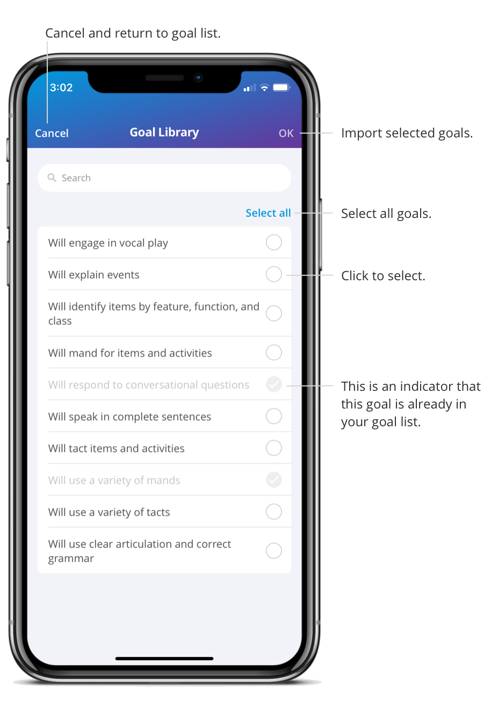

You can utilize the goal library created by the agency.  

1. On a Care Plan, click the "+" button in the bottom right corner 
2. Choose a domain 
3. Choose a subdomain 
4. Select “Browse Goal Library” 
5. Select one or multiple goals from the goal library 
6. Select “Import”  

The goals are now in your goal list. If you would like to add a goal to the care plan, select a goal and you will be brought to the target list page where you can choose to add the targets later or select the targets and click “Add.” 