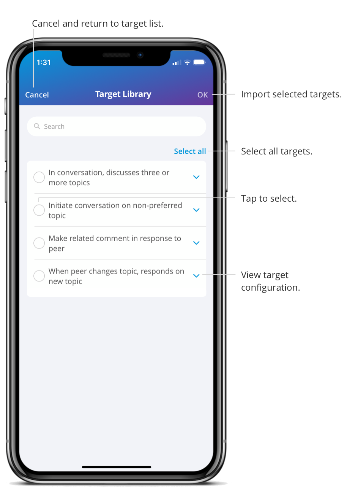

You can utilize the target library created by the agency. This makes it easier for the BCBAs to create and update care plans.

1. On a Care Plan, click the "+" button in the bottom right corner 

2. Choose a domain 

3. Choose a subdomain 

4. Choose a goal 

5. Select “Browse Target Library” 

6. Select one or multiple targets from the target library 

7. You can view the target configuration by clicking the expand arrow 

8. Select “Import”  

The targets are now in your target list. If you would like to add a target to the care plan, select the target and click “Add.” 