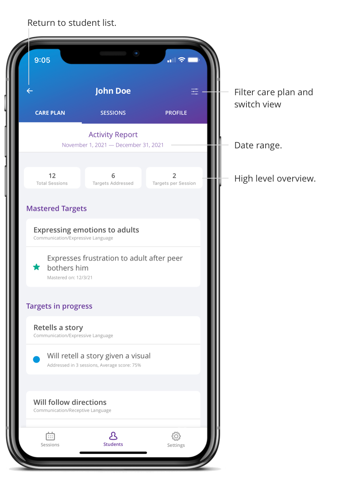

This report allows you to review all activity in a student's care plan in a specified period of time. 

  
1. Click on a student 

2. Click the filter button in the top right corner 

3. Select Activity Report under the “View” category 

4. Choose date range and whether to display graphs 

5. Click “Apply” 

## What’s included? 

- Targets with activity within selected timeframe  

- Targets whose status was active, baseline or maintenance at the last day of the selected time frame    

You can view the number of sessions, number of distinct targets, and average number of targets per session in the specified date range. You can also view date of mastery on mastered targets and see how many sessions every target was addressed in and the average score of all targets displayed.

[Demo video: Viewing the Activity Report](https://youtu.be/MltVclMUltI "Title")