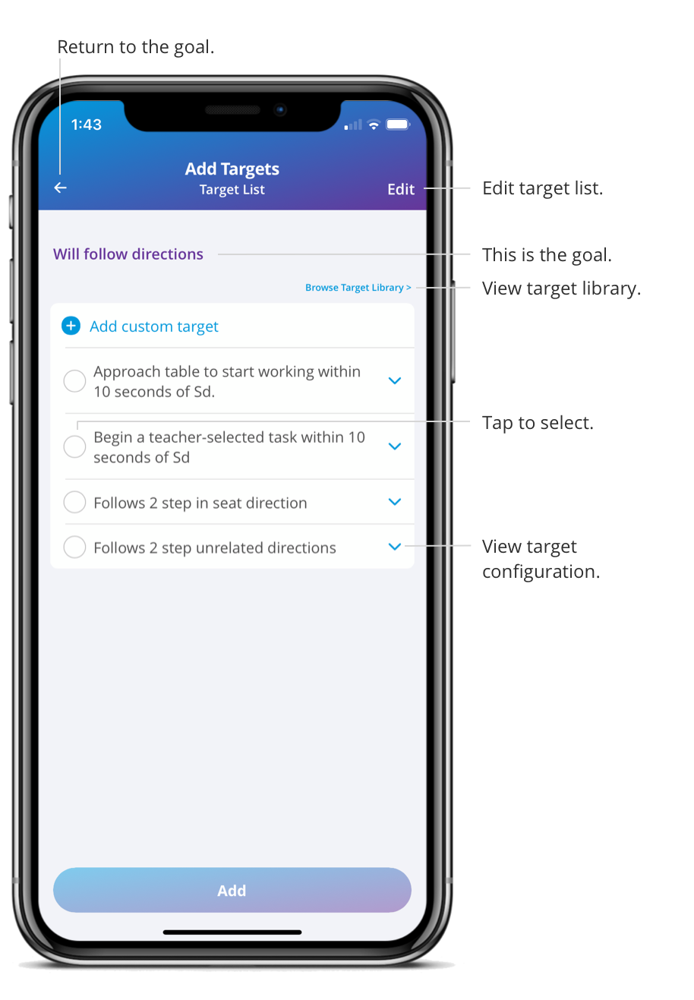
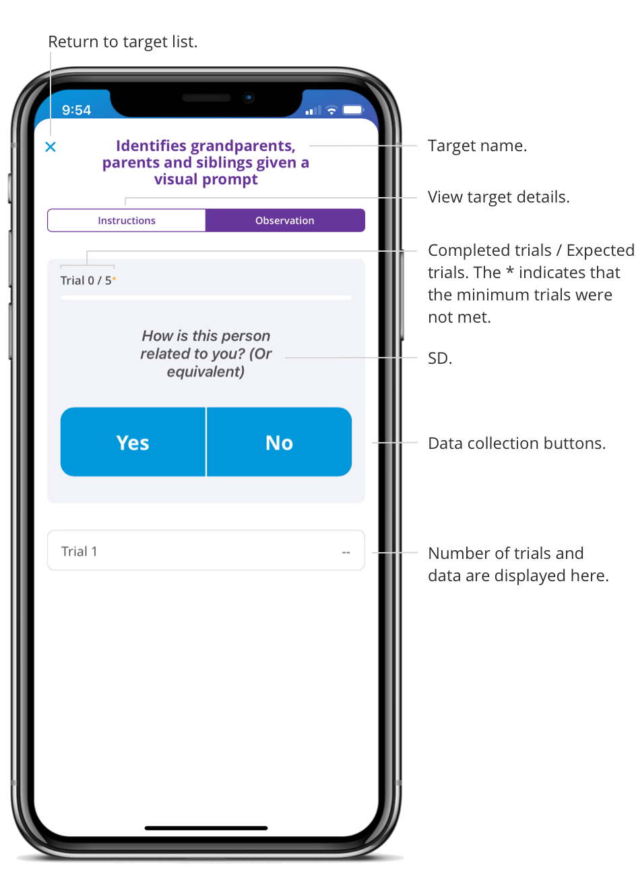

When you start a direct care session, you will be able to start data collection.

1. Click on a session in your calendar.   

2. Click “Start session.” 

3. Swipe from the right side of the screen and a Start button will appear.  

4. Or click on a target and begin collecting data. 

When you are finished collecting data, click the back arrow or End Session on the general tab. 

[Demo video: Data Collection on Target List and Target Card](https://youtu.be/-wdmkUeijpY/ "Title")

### Data Collection on the Target List

This feature gives you the ability to collect data on multiple targets at the same time. Not only does this save time, but it also allows you to focus more on the patient than your phone.   

1. Swipe from the right side of the screen and a Start button will appear. 

2. Click Start  

3. Begin collecting data 

Each time you click yes or no, the trial count gets updated, and the last response is noted. The second number represents the number of expected trials, and the small indicator is displayed when the minimum trials were not met. I can swipe from the right to undo the previous action, and the trial count and last response will update. 

### Data Collection on the Target Card

This feature gives you the ability to dive into a target with no other distractions and review the instructions of the target or behavior.  

1. Click on the target. 

2. Begin collecting data. 

Each time you click yes or no, the trial count gets updated, and the last response is noted. The second number represents the number of expected trials, and the small indicator is displayed when the minimum trials were not met. You can click undo to delete the previous action, and the trial count and last response will update.
 
If you want to see more information about the target, you can click on the instructions tab where the target configuration is displayed.  

Click the X button to go back to the target list.  

### Edit Data after the Session

After you end your session, you can edit the session data by selecting a target and clicking Edit in the top right corner.  

)

You can add, delete or change a response. Click OK to save your changes. 
