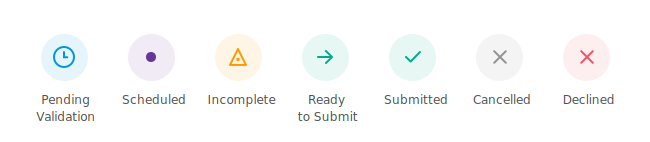

To help you differentiate between sessions, every session has a session status. The status icon appears for each session on the session list. You can also see the status in the General tab of the session. Sessions are color-coded to help you make sense of your schedule at a glance. 

**Pending Validation** – Your session will soon be validated by the agency's server.
**Validating** – Your session is currently being validated by your agency. You cannot edit scheduling details while your session is validating.
**Scheduled** – Your session is approved by your agency.
**Incomplete** – Your session is missing required session data. Once a session is in the past, session data is required. Enter the missing details to complete your session.
**Ready to Submit** – Your session is valid and has session data.
**Submitted** – Your session has been submitted. You cannot edit a submitted session.
**Cancelled** – Your session was cancelled. You can see the reason for cancellation in the General tab of the session. You cannot edit a cancelled session.
**Declined** – Your session has been declined by your agency. You can see the reason in the General tab of the session. Reach out to your case manager if you are still unsure why your session was declined. You can edit the session to correct the issue.