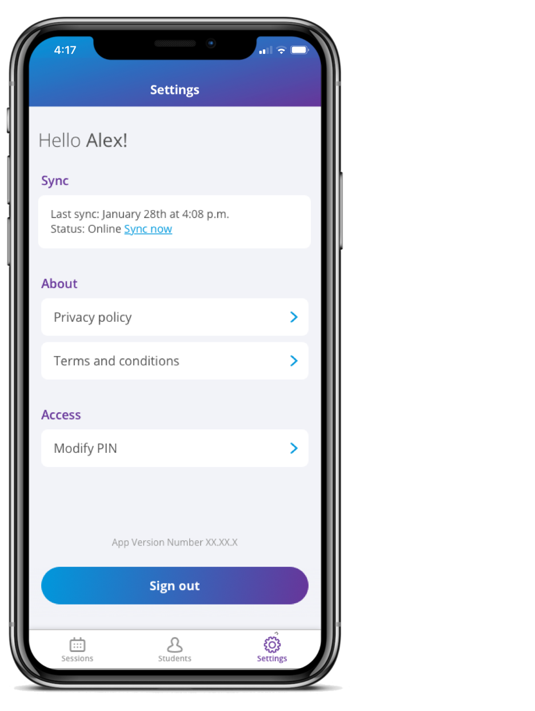

Syncing is the process that allows all the data to be shared with different devices and providers on the care team. 

## Keep in mind 

- When logging into the app, it is necessary to be connected to a stable network to ensure that any data added on a different device is being displayed on yours. 

- If you don’t have service after logging in, the data will be saved on the device, and the app will sync the next time the device is connected to a network. 

You can manually sync your device by going to the Settings tab and clicking "Sync now" while the device is connected to a network. 